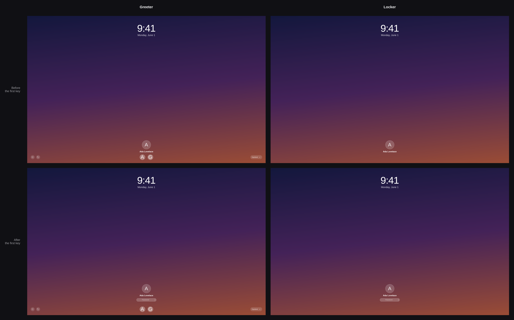

# PSLDM

[](https://github.com/DNAPrototypeX/PSLDM/actions/workflows/ci.yml)

Paul's Screen Locker and Display Manager: one login pane with two front ends.
The greeter logs you in. The locker unlocks a session that already runs. Both
draw the same pane from the same code, so the two screens match. The look
follows macOS Sonoma.



The greeter adds the power buttons, the user picker, and the session list.
Nothing else differs.

PSLDM works with Hyprland only. greetd starts the greeter in its own Hyprland
instance. The locker uses the Hyprland session lock. `install.sh` reads the
monitor modes with `hyprctl`.

## Install

Install the dependencies, then run the script inside Hyprland:

```sh
sudo pacman -S --needed rust clang gtk4 gtk4-layer-shell pam accountsservice greetd hyprland
git clone https://github.com/DNAPrototypeX/PSLDM.git
cd PSLDM
./install.sh --greeter --wallpaper ~/Pictures/wallpaper.png
```

The script builds the programs, copies them to `/usr/local/bin`, and writes
the PAM file, the wallpaper, your avatar, your font, and the greetd files. It
keeps a copy of every file that it replaces, with the suffix `.psldm-backup`.
Run `./install.sh --help` for the options, and `./install.sh --uninstall` to
remove everything again.

`--greeter` reads the monitor modes with `hyprctl`, so Hyprland must run. The
greeter then shows the pane at the size of your session. Run the script again
after you change a monitor, a font, or an avatar.

## Lock the screen

1. Test the locker: `psldm-lock --preview`.
2. Add `dofile("/path/to/PSLDM/packaging/hypr/psldm-lock.lua")` to
   `~/.config/hypr/hyprland.lua`.
3. Press SUPER + L.

That file binds `pgrep -x psldm-lock || psldm-lock`. The guard keeps one
locker on the screen at a time. Give the same command to `hypridle`, with the
full path, because an idle daemon often runs with a short PATH.

The file also sets `misc.allow_session_lock_restore`. Hyprland needs this
setting to give the lock to a new locker after a crash.

## Log in with the greeter

1. Test the greeter: `psldm-greet --preview ~/Pictures/wallpaper.png`.
2. Open a second text console, and log in there.
3. Run `sudo systemctl enable greetd.service`.
4. Restart the computer.

greetd starts `/usr/local/bin/psldm-greeter-session` on virtual terminal 1.
That script runs `start-hyprland`, the watchdog that Hyprland ships. The
watchdog restarts Hyprland after an unclean exit, so a crash brings the
greeter back instead of a text console.

## Crates

| Crate | Purpose |
| --- | --- |
| `psldm-ui` | The shared login pane, its state machine, and the stylesheet |
| `psldm-auth` | The greetd backend and the PAM backend, behind one channel pair |
| `psldm-session` | Users, avatars, and sessions, from AccountsService and desktop files |
| `psldm-greet` | The greeter for greetd |
| `psldm-lock` | The locker |

The two programs choose a surface and a backend. The greeter draws on a layer
shell surface and speaks to greetd. The locker draws on an
`ext-session-lock-v1` surface and speaks to PAM. Hyprland keeps the lock
surface even if `psldm-lock` stops, so a crash does not open the session.

## Requirements

- `hyprland` 0.56 or later. It gives `ext-session-lock-v1`, `start-hyprland`,
  `hyprctl`, and the Lua configuration format.
- `gtk4` 4.12 or later, and `gtk4-layer-shell` 1.3 or later.
- `accountsservice`, for the user list and the avatars.
- `greetd`, for the greeter only.
- `python3`, for the monitor modes that `install.sh --greeter` writes.
- `clang`, for the build. The `pam-sys` crate runs `bindgen`, which loads
  `libclang`.

The two Hyprland files use the Lua format, which Hyprland 0.56 reads. Hyprland
still reads the older `.conf` format, and it plans to drop it.

## Develop

```sh
cargo build --release
cargo test --workspace
cargo clippy --workspace --all-targets -- -D warnings
```

The workspace holds 9 tests for the state machine and one pixel test. The
pixel test draws both modes and compares every pixel, so a change that only
one mode shows makes it fail.

GitHub Actions runs the same three commands in an Arch Linux container. See
`.github/workflows/ci.yml`.

This command draws the picture at the top of this page:

```sh
cargo run -p psldm-ui --example comparison -- docs/comparison.png
```

## License

GPL-3.0-or-later. PSLDM contains code from ReGreet. See `ATTRIBUTION.md`.
